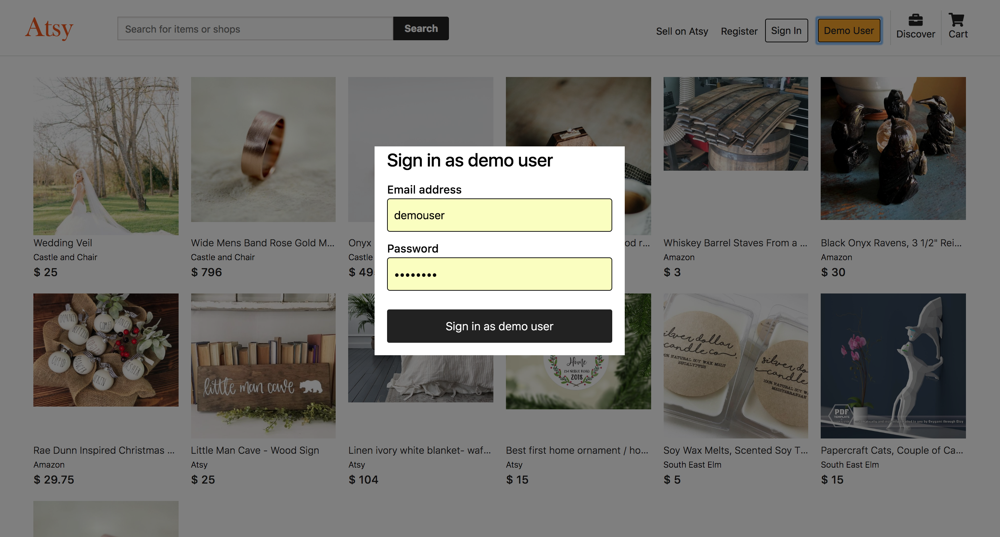
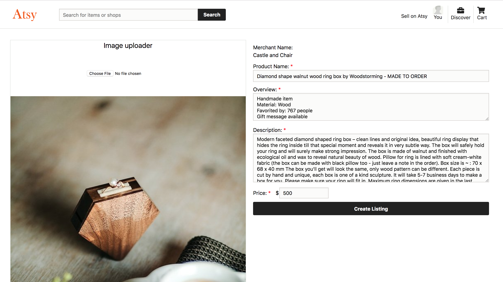
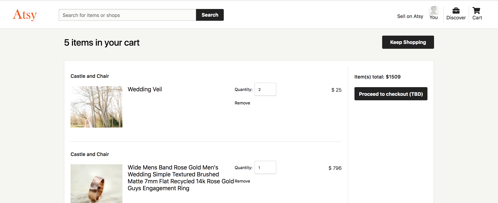
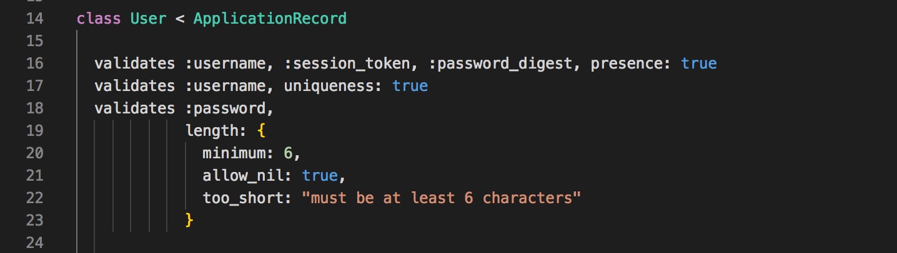
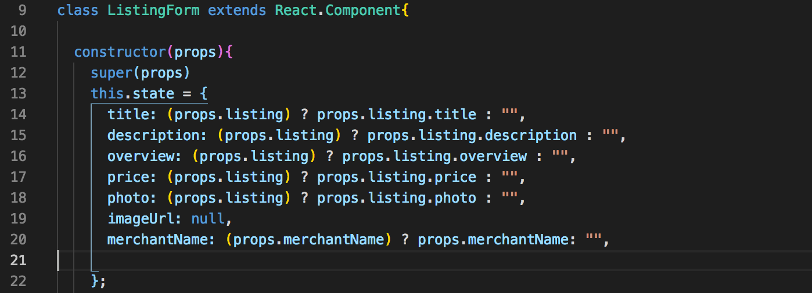

# [Atsy](https://craftsy-etsy-clone.herokuapp.com/)

Atsy is an ecommerce website for craft. It is inspired by Etsy. It is built on Rails and PostgreSQL backend with React and Redux frontend.

This project was built within a 10 days timeframe. I do plan on implementing new features on this project over time. Features for planned release:
  1. Search
  2. Categories
  3. User / Profile page
  
  
# Features 

1. Secure frontend to backend user authentication using BCrypt.
2. Logged in user can create/edit/update/delete Listings.
  * Listing is created with a user upload photo attachment.
  * Only authors of listing can edit/delete the listing.
  * view listings by merchant.
3. Logged in user can add listings into personal cart. 
  * Listings in cart remain in cart even after session is signed out / signed in.
  * Cart quantity can be updated. Price in cart recalculates based on listings in cart.
4. User can write reviews on listing.
  * Reviews that belong to a site is displayed on the listing page.

Signup page

Create Listing page

Cart page

Comment

# Implementations

## 1. User model validations

Validations to enforce mandatory fields for username and password. Passwords are salted and hashed using BCrypt before it is stored in database. This ensures sensitive data like passwords are not stored as plain text. Besides that, custom error messages is displayed to user if minimum requirement is not met.

## 2. Reusing components

The form component is shared and used for both create listing and edit listing. For create listing, if no existing form props are received, fields are populated with empty fields.
For edit listing, if existing form props are receiving, the fields are pre-populated with existing values.

